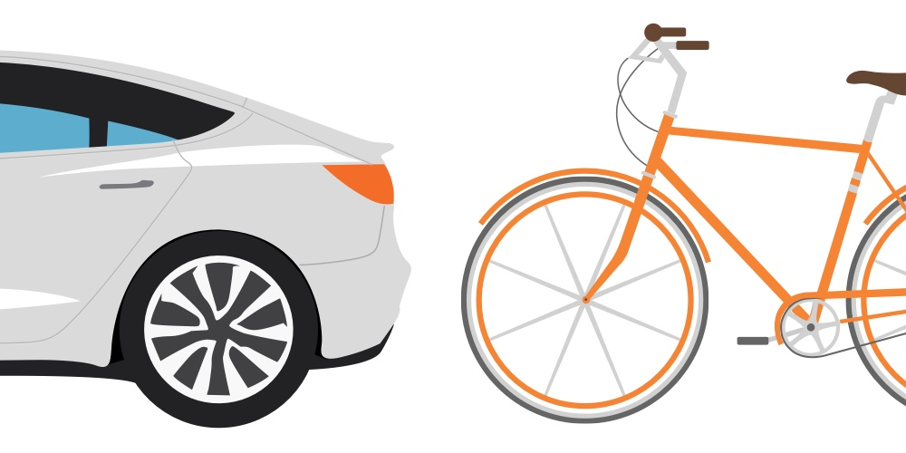

<p align="center">
  
  <h1 align="center">Vivre sans voiture</h1>
  <p align="center">par Arthur Lacoste<p>
</p>

Ce dépôt est dédié au livre _Vivre sans voiture_ de [Arthur Lacoste](https://arthurlacoste.com).

- Aller sur [le site web](https://sansvoiture.fr)
- Vous pouvez [pré-commander le livre](#) et ainsi aider le projet
- Vous pouvez [vous abonner par mail](https://sansvoiture.fr/newsletter/) pour suivre le progrès du projet
- Vous pouvez [suivre le progrès du projet en ligne](https://sansvoiture.fr/timeline/)
- Vous pouvez [proposer vos idées](https://github.com/arthurlacoste/vivre-sans-voiture/issues)

## Installation

```shell
git clone https://github.com/arthurlacoste/vivre-sans-voiture/
npm install grunt -g
npm install
```

Pour créer un serveur temporaire :

```
grunt serve
```
